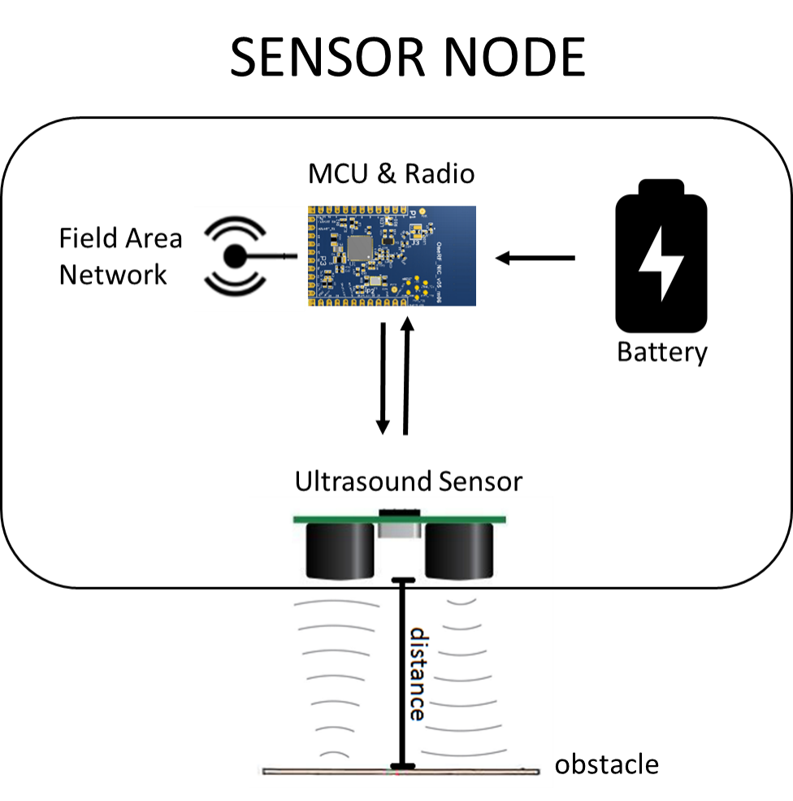
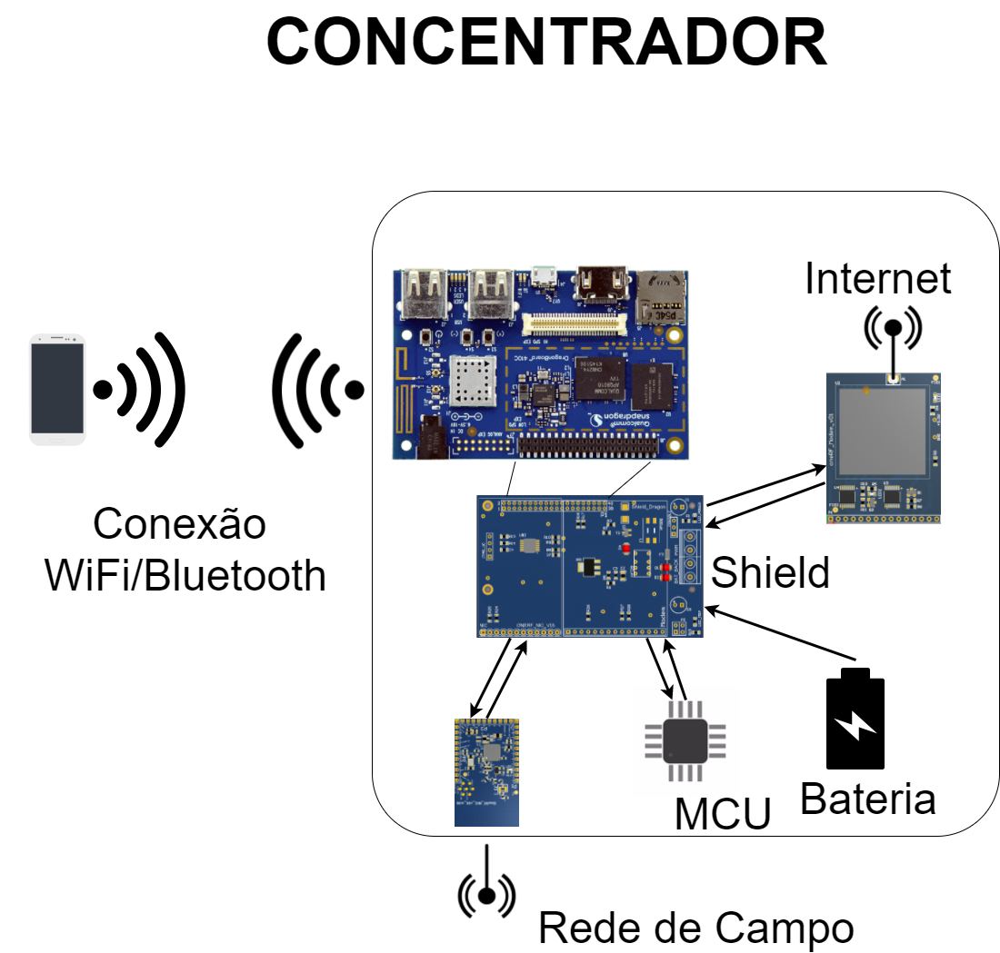

# ReSeNI

**Project description**

The project proposes a wireless-level sensor network for the enhancement of essential urban services.
By means of an ultrasonic sensor it is possible to determine the distance of an object/obstacle from the sensor.
In this way the level of liquids or solids can be determined with the same sensor.

Immediate applications are listed below:

- Monitoring of water level in homes and buildings.
In Brazil, there are regions where water supply is scarce (eg, northeast) and other regions with sporadic water crises (eg São Paulo 2014-2015).
By knowing the level of the water reservoirs in a significant number of buildings it is possible to direct water to the most critical places, that is, to make an intelligent water management.
In addition, the system can provide data to regulatory agencies and allow monitoring of the quality of the service, since the information disclosed by the sanitation companies does not always match what is reported by the population.

- Level monitoring of water in rain and river galleries (urban drainage).
Several Brazilian cities suffer from flooding points, which causes great damage to the public power and individuals.
Through the continuous monitoring of the water level of river and storm galleries, it is possible to identify flood risk, clogging points and bottleneck points in drainage.
This makes possible the intelligent management of the urban drainage and management system.

- Level monitoring of garbage in dumps or litter bins arranged in city streets.
The collection of urban waste is an essential service for the control of diseases, for the well being of the population and for environmental management.
Moving a collection team to empty dumps creates unnecessary cost; on the other hand, leaving a dump with waste for a long time causes problems due to the deterioration of the materials present.
By knowing the filling state of the dumps, dump buckets and collection points, the person responsible for the collection can trace an efficient route and also ensure that the collection time is fulfilled.
Efficient routes mean less spending on fuel, staff and fleet reduction.

**Hardware**

Wireless Sensor Network (WSN) technology combines sensing, computing, and communication in a small device.
The Network consists of several wireless sensing nodes and a hub node that sends the data to the cloud.
The proposed project seeks to provide a low-cost, long-range, robust and self-diagnostic WSN solution to operate in remote environments without direct human intervention.
These features are available for a solution and a low cost of deployment and maintenance.

The measurements of the alarms and parameterization of the WSN will be done via Coap Protocol (Conformed Application Protocol) or MQTT (Telemetry Transport of Message Placement).
The nodes can schedule readings for the Concentrator or generate alarms if there is an abrupt level change.
The sensor nodes are purposely simple. Thus, the processing capacity of the sensor nodes is low to minimize the energy consumption and the final cost of the solution. It allows the connection of hundreds of os unities to a single node concentrator.
The concentrators store the measurements, variable of alarm and battery of battery for the last readings.
It's up to the Node to keep the data, send it to a cloud and manage a WSN.
The concentrator node must be robust in the electronics and software aspects as it will be installed in remote places of hard access. Furthermore, it will be able to hold high processing capacity and memory for clients as the network can have hundreds of sensors.

The use of WSN can be further extended to other Intelligent Cities applications. With new application boards, it can be used for measurement of quantities such as pressure, temperature, humidity, airflow, and detection of chemical elements such as pH, CO2, O3, CH3 and toxic gases.

The developed sensor node consists of:

- IEEE 802.15.4 standard radio module, in the 900 MHz band and IPV6 technology, capable of forming networks in mesh topology.

- Application plate with ultrasonic sensor for command and signal conditioning circuit.
-Battery and power circuit.

- box with double-sided adhesive on the side, on/off switch and status LED to aid in field installation.

The concentrator node will consist of:

- Qualcomm DragonBoard 410C responsible for connection to the cloud, storage, processing of sensor node readings, and management of WSN.
The board will run Linux on a partition read-only to minimize a chance of errors and two separate partitions for data for redundancy.

- Base board with 100-240V AC power circuit with surge, over voltage, and over current protection. The board will also contain an MCU to monitor the state of other devices on the board.
If any of them present a falty state, the MCU can use a telephone network to send an SMS and notify a hub situation.

- Commercial card with 3g modem.

- Module radio to talk to an RSSF.

- IP65 fully enclosed, a local configuration of the hub at the time of installation will be made by Bluetooth or WiFi via http interface that can be accessed by the field technician's phone or tablet.

