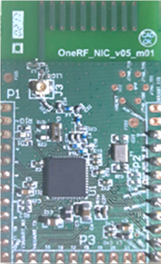
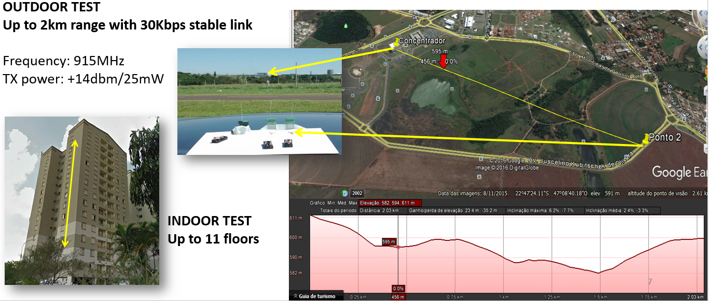

**Radio Module oneRF_NIC**

It's a compact, low-power circuit board with ARM processor, RF interface and integrated antenna.
The module firmware manages all aspects of radio communication with OneRF's RF Mesh network.
The firmware can be customized to integrate the module with specific client protocols and needs.
Its design allows easy integration into new customer application. 

**Current Radio protocols:**
-HTTP REST
-IPv6
-UDP
-IEEE 802.15.4g

**External Hardware interface:**
-01 x Serial TTL
-01 x SPI
-01 x I2C
-10 x GPIOs
-05 x ADCs

**Complete Specification:**
-32-bit ARM Cortex-M3
-28 kB RAM and 128 kB Flash
-1.8V to 3.3V power supply
--40 °C to + 85 °C operating temperature
-Internal battery monitor and temperature sensor
-PCB type and UF.L antenna
-+14 dbm (25mW) TX power
-863 to 876 MHz and 902 to 928 MHz frequency bands
-Data rate up to 100 kbps
-2-GFSK modulation

**Radio Module Range Test:**
We performed two radio range tests with 915 MHz band frequency, +14dbm/25mW TX power and 2-GFSK modulation.
In the open field test, we were able to maintain a stable 30 kbps link between Radio Modules up to 2 km distance.
In the indor test, the Radio Modules were placed inside a buiding. 
We were able to maintain a stable 30 kbps link between them up to a 11 floor distance.

